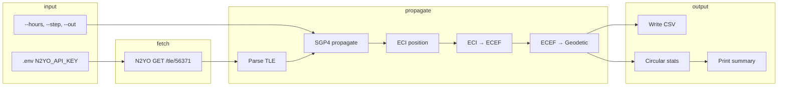
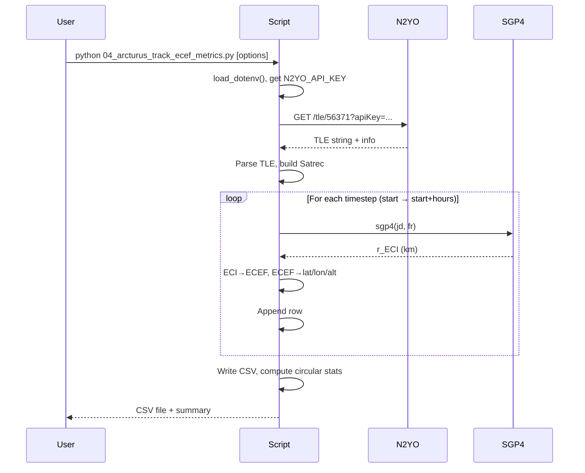

# Arcturus ECEF Tracker

## Overview

`04_arcturus_track_ecef_metrics.py` fetches Two-Line Element (TLE) data for **Arcturus** (Astranis, NORAD 56371) from the N2YO API, propagates the orbit for a configurable time window using SGP4, and writes geodetic and ECEF positions plus stationkeeping-style metrics to a CSV file.

- **Geodetic coordinates**: Latitude (°), longitude (°), and altitude (km) on WGS84.
- **ECEF coordinates**: X, Y, Z (km) in Earth-Centered, Earth-Fixed frame.
- **Stationkeeping metrics**: Circular mean, standard deviation, and span of longitude; max |latitude|; altitude mean and standard deviation over the prediction window.

Positions are computed at fixed time steps, rotated from ECI (TEME) to ECEF via GMST, then converted to geodetic. Results are written to a CSV and a short summary is printed to the console.

---

## API Endpoint & Parameters

### N2YO TLE endpoint

| Item | Value |
|------|--------|
| **URL** | `https://api.n2yo.com/rest/v1/satellite/tle/{norad_id}&apiKey={api_key}` |
| **Method** | GET |
| **Path parameter** | `norad_id` — NORAD catalog ID (script uses **56371** for Arcturus). |
| **Query** | `apiKey` — N2YO API key (from environment). |

### Environment

- **`N2YO_API_KEY`** — N2YO API key, loaded from a `.env` file in the project root (via `python-dotenv`). Required; script exits with an error if missing.

### N2YO response (relevant fields)

- **`info.satname`** — Satellite name (e.g. `"ARC'TURUS"`).
- **`tle`** — String containing the two TLE lines, separated by `\r\n` or `\n`.

---

## Data Structure

### Output CSV columns

| Column | Type | Description |
|--------|------|-------------|
| `timestamp_utc` | ISO 8601 string | UTC time of the propagated position. |
| `lat_deg` | float | Geodetic latitude (WGS84), degrees. |
| `lon_deg` | float | Geodetic longitude (WGS84), degrees [-180, 180]. |
| `alt_km` | float | Height above WGS84 ellipsoid, km. |
| `x_ecef_km` | float | ECEF X, km. |
| `y_ecef_km` | float | ECEF Y, km. |
| `z_ecef_km` | float | ECEF Z, km. |

### Printed summary metrics

| Metric | Description |
|--------|-------------|
| `mean_lon_deg` | Circular mean of longitude. |
| `lon_std_deg` | Circular standard deviation of longitude. |
| `lon_span_deg` | Max − min longitude around the circular mean (wrap-safe). |
| `max_abs_lat_deg` | Maximum absolute latitude. |
| `alt_mean_km` | Mean altitude. |
| `alt_std_km` | Standard deviation of altitude. |

---

## Flow (Mermaid)



High-level sequence:



---

## Usage

### Prerequisites

- Python 3 with: `requests`, `python-dotenv`, `numpy`, `sgp4`.
- A `.env` file in the project root (or parent) with:

  ```env
  N2YO_API_KEY=your_n2yo_api_key_here
  ```

### Command line

From the repo root or from `01_query_api/`:

```bash
# Default: 24 h, 60 s step, output arcturus_24h_track.csv
python 01_query_api/04_arcturus_track_ecef_metrics.py

# Custom duration and step
python 01_query_api/04_arcturus_track_ecef_metrics.py --hours 12 --step 120

# Custom output file
python 01_query_api/04_arcturus_track_ecef_metrics.py --out my_track.csv
```

### Arguments

| Argument | Type | Default | Description |
|----------|------|---------|-------------|
| `--hours` | float | `24.0` | Propagation duration from "now" (UTC), in hours. |
| `--step` | int | `60` | Time step between positions, in seconds. |
| `--out` | str | `arcturus_24h_track.csv` | Output CSV path (relative or absolute). |
| `--no-history` | flag | — | Do not append the fetched TLE to the history file. |
| `--record-only` | flag | — | Only fetch TLE and append to history; no propagation or CSV output. |

### TLE history and station-keeping burns

Each run (unless `--no-history` is set) appends the current TLE to **`01_query_api/data/tle_history_56371.csv`**. The Streamlit app in `03_ai_api_calls/arcturus_app.py` uses this history to:

- **Detect station-keeping burns** by comparing consecutive TLEs (changes in inclination, RAAN, eccentricity, or mean motion above configurable thresholds).
- **Plot maneuver frequency** (burns per week) and show a burn table.

To build history without running propagation:

```bash
python 01_query_api/04_arcturus_track_ecef_metrics.py --record-only
```

The module **`tle_history.py`** in `01_query_api/` provides `load_tle_history()`, `detect_burns()`, and `burns_per_week_series()` for use in other scripts.

### Example output

```
TLE fetch status code: 200
satname: ARC'TURUS
satid: 56371

Wrote 1441 points to arcturus_24h_track.csv

24h summary (from propagated positions):
  mean_lon_deg:     -xxx.xxxxxx
  lon_std_deg:      x.xxxxxx   (circular std dev)
  lon_span_deg:     x.xxxxxx  (max-min around mean, wrap-safe)
  max_abs_lat_deg:  x.xxxxxx
  alt_mean_km:      xxx.xxx
  alt_std_km:       x.xxx

Preview (first 3 rows):
{'timestamp_utc': '...', 'lat_deg': ..., ...}
...
```

If `N2YO_API_KEY` is missing or the TLE request returns a non-200 status, the script prints an error and exits.
