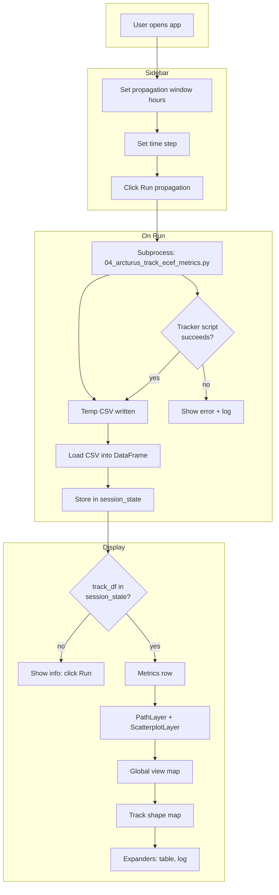
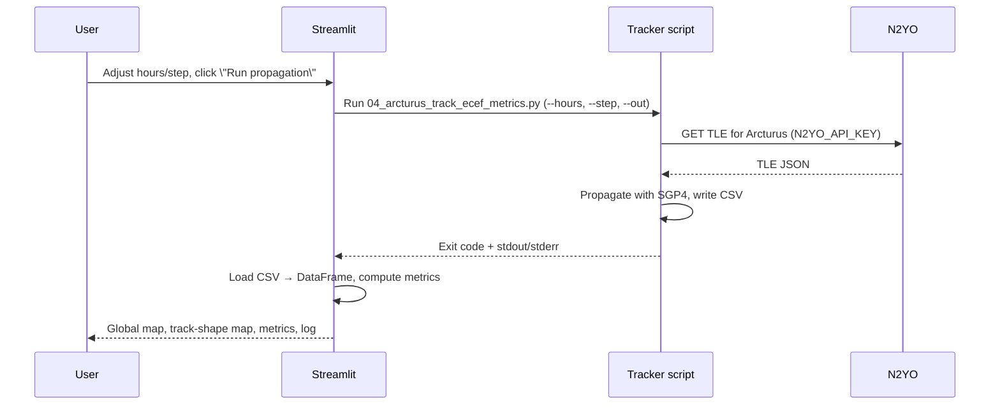

# Arcturus Orbit Viewer

## Overview

`app.py` is a Streamlit app that runs `01_query_api/04_arcturus_track_ecef_metrics.py` to propagate the **Arcturus** satellite (Astranis, NORAD 56371) and visualize its ground track with an Astranis-inspired dark theme.

- **Global view map**: World map with the full geodetic track (PathLayer) and the current spacecraft position highlighted.
- **Track shape map**: Narrow, zoom-to-fit view that emphasizes the detailed shape of the propagation path.
- **Orbit metrics**: Live metrics for point count, mean longitude/latitude, and altitude statistics over the selected propagation window.

The app runs the tracker script as a subprocess, reads the generated CSV into a DataFrame, and renders the orbit using PyDeck on WGS84 coordinates.

---

## API Endpoint & Parameters

### Tracker script (subprocess) interface

| Item | Value |
|------|--------|
| **Script** | `01_query_api/04_arcturus_track_ecef_metrics.py` |
| **Invocation** | Called via `sys.executable` from `app.py` with CLI flags. |
| **Working directory** | Repository root (so `.env` is discovered by the tracker). |

### CLI parameters passed by the app

| Parameter | Source | Description |
|-----------|--------|-------------|
| `--hours` | Sidebar slider (`hours`) | Propagation window from "now" (UTC), in hours (1–72, default 24). |
| `--step` | Sidebar select box (`step`) | Time step between propagated points, in seconds (60, 120, 300). |
| `--out` | Temporary file path | CSV output file created in a temp directory, then read and removed. |

### Environment

- **`N2YO_API_KEY`** — N2YO API key in the project-root `.env`; required by the tracker script to fetch TLE data. If missing or invalid, the underlying script fails and the app shows the error log.

---

## Data Structure

### CSV / DataFrame columns

The tracker script writes a CSV, which the app loads into a pandas DataFrame `df` with:

| Column | Type | Description |
|--------|------|-------------|
| `timestamp_utc` | ISO 8601 string | UTC timestamp of the propagated position. |
| `lat_deg` | float | Geodetic latitude (WGS84), degrees. |
| `lon_deg` | float | Geodetic longitude (WGS84), degrees [-180, 180]. |
| `alt_km` | float | Altitude above WGS84 ellipsoid, km. |
| `x_ecef_km` | float | ECEF X coordinate, km. |
| `y_ecef_km` | float | ECEF Y coordinate, km. |
| `z_ecef_km` | float | ECEF Z coordinate, km. |

The app constructs:

- **`path_data`** — List of `[lon_deg, lat_deg]` pairs used by a PyDeck `PathLayer` to render the full orbit ground track.
- **`scatter_df`** — One-row DataFrame with `lon`, `lat`, and `alt_km` for the last propagated point (current spacecraft position).

### Metrics derived in the app

| Metric | Description |
|--------|-------------|
| `Points` | Number of propagated points (rows in `df`). |
| `Mean longitude (°)` | Arithmetic mean of `lon_deg`. |
| `Mean latitude (°)` | Arithmetic mean of `lat_deg`. |
| `Altitude mean (km)` | Mean of `alt_km`. |
| `Altitude std (km)` | Standard deviation of `alt_km`. |

---

## Flow (Mermaid)

### App flow (flowchart)



High-level sequence:



### Process diagram (inputs → steps → outputs)

```mermaid
flowchart LR
    subgraph inputs["Inputs"]
        I1[Propagation window<br/>hours, step]
        I2[N2YO_API_KEY in .env]
        I3[Tracker script<br/>04_arcturus_track_ecef_metrics.py]
    end

    subgraph steps["Steps"]
        S1[Run tracker subprocess]
        S2[Load CSV → DataFrame]
        S3[Compute metrics]
        S4[Build path + scatter layers]
        S5[Render PyDeck maps]
    end

    subgraph outputs["Outputs"]
        O1[Metrics row]
        O2[Global view map]
        O3[Track shape map]
        O4[Track table + propagation log]
    end

    inputs --> S1 --> S2 --> S3 --> S4 --> S5 --> outputs
```



---

## Stakeholder needs → system goals

| Stakeholder need | System goal |
|------------------|-------------|
| See where Arcturus is (and will be) over a time window | Run SGP4 propagation from live TLE and show the ground track on a map. |
| Compare global orbit vs detailed path shape | Provide two views: a global map and a zoom-to-fit track-shape map. |
| Adjust how far ahead and how fine the prediction is | Expose propagation window (hours) and time step (seconds) in the UI. |
| Get quick orbit stats without reading raw CSV | Compute and display metrics (point count, mean lon/lat, altitude mean/std). |
| Debug when propagation or API fails | Run tracker in subprocess and surface stdout/stderr in an expandable log. |
| Use one place for run + visualize (no CLI only) | Integrate tracker script as a subprocess so "Run propagation" runs and displays in the same app. |

---

## Usage

### Prerequisites

- Python 3 with the tracker dependencies installed (`requests`, `python-dotenv`, `numpy`, `sgp4`, etc.).
- Streamlit app dependencies (local to `shiny_app`):

  ```bash
  pip install -r 02_productivity/shiny_app/requirements.txt
  ```

- A `.env` file at the **project root** (`/Users/iansteigmeyer/Documents/sandbox`) containing:

  ```env
  N2YO_API_KEY=your_n2yo_api_key_here
  ```

### Running the app

From the project root:

```bash
cd /Users/iansteigmeyer/Documents/sandbox
streamlit run 02_productivity/shiny_app/app.py
```

Or from the app directory:

```bash
cd /Users/iansteigmeyer/Documents/sandbox/02_productivity/shiny_app
streamlit run app.py
```

Then open the URL that Streamlit prints (typically `http://localhost:8501`) in your browser.

### App controls

| Control | Location | Description |
|---------|----------|-------------|
| `Propagation window (hours)` | Sidebar slider | Controls `--hours` (1–72, default 24). |
| `Time step (seconds)` | Sidebar select box | Controls `--step` (60, 120, 300). |
| `Run propagation` | Sidebar button | Launches the tracker script, reloads CSV, updates maps and metrics. |

### Example behavior

After a successful run:

```
TLE fetch status code: 200
satname: ARC'TURUS
satid: 56371

Wrote NNNN points to /tmp/tmpXXXXX.csv
...
```

The app:

- Shows updated orbit metrics at the top.
- Renders the **Global view** map with the full ground track and current spacecraft position.
- Renders the **Track shape** map (1/3 width), zoomed to fit the track without cutting off any data.
- Provides a "Track data (first 10 rows)" expander and a "Propagation log" expander for debugging.

If the tracker subprocess fails (e.g. bad `N2YO_API_KEY` or network error), the app displays a red error message and the captured log output instead of updating the maps.
