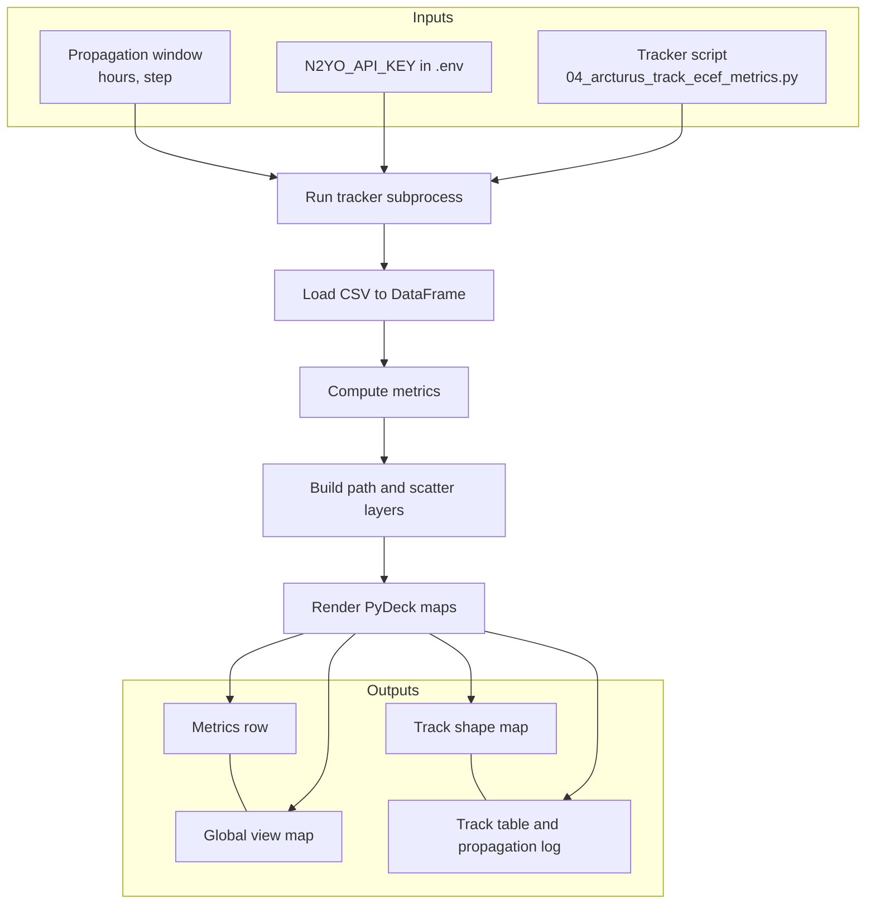

# Arcturus tracking app — process diagram and stakeholder mapping

Homework tool: **Arcturus orbit viewer** (Streamlit app in `02_productivity/shiny_app`). It runs the tracker script `01_query_api/04_arcturus_track_ecef_metrics.py` and visualizes the satellite ground track on two PyDeck maps.

---

## Process diagram (inputs → steps → outputs)

---

## Stakeholder needs → system goals

| Stakeholder need | System goal |
|------------------|-------------|
| See where Arcturus is (and will be) over a time window | Run SGP4 propagation from live TLE and show the ground track on a map. |
| Compare global orbit vs detailed path shape | Provide two views: a global map and a zoom-to-fit track-shape map. |
| Adjust how far ahead and how fine the prediction is | Expose propagation window (hours) and time step (seconds) in the UI. |
| Get quick orbit stats without reading raw CSV | Compute and display metrics (point count, mean lon/lat, altitude mean/std). |
| Debug when propagation or API fails | Run tracker in subprocess and surface stdout/stderr in an expandable log. |
| Use one place for run and visualize (no CLI only) | Integrate tracker script as a subprocess so "Run propagation" runs and displays in the same app. |
