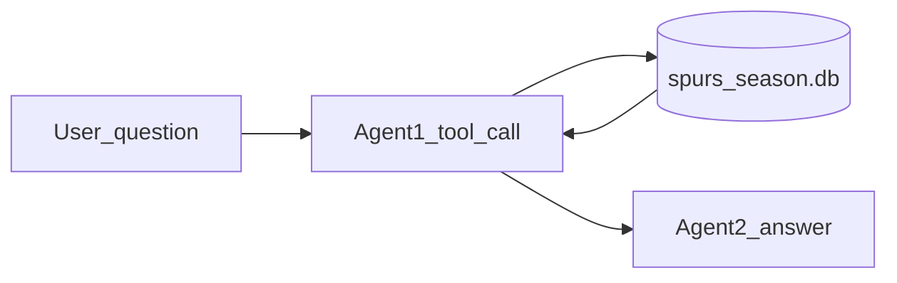

# Spurs multi-agent lab

**Quick start (commands only):** [QUICKSTART_SPURS.md](QUICKSTART_SPURS.md). **RAG CLI / refresh (`spurs_season_rag.py`):** [README_spurs_season_rag.md](README_spurs_season_rag.md).

`lab_spurs_multi_agent.py` runs a **two-agent** workflow over a local **SQLite** database of **San Antonio Spurs** player game lines: **Agent 1** calls exactly one retrieval **tool** (Ollama function calling); **Agent 2** writes a short answer from the retrieval block only. Retrieval uses **`spurs_season_store.py`**; aggregates use **`spurs_stats.py`**; HTTP to Ollama uses **`functions.py`**.

---

## Overview

- **Agent 1**: Must call one of the tools below once; no invented box scores.
- **Agent 2**: Answers from the markdown + **`precomputed_stats`** + **Trusted line** only; prompt style depends on which tool ran (**fact** vs **recap**). Fact prompts favor neutral copy, aggregates from the Trusted line over single-game extremes, and explicit wording when the retrieval is only a slice of the season.
- **Direct mode**: `--direct` runs a tool without the LLM (smoke tests).

**Main outputs**

- **Markdown table** — player-game rows for the query scope.
- **`precomputed_stats`** — JSON aggregates (games, per-player averages) computed in Python.
- **Trusted line** — one deterministic sentence when a focus player is detected.

---

## Data structure

| Item | Description |
|------|-------------|
| **Default DB** | `data/spurs_season.db` under `08_function_calling` (override with `--db`). |
| **Table** | `player_game` — one row per player per game (`game_id`, `game_date`, `player_name`, box stats, `nba_season`). |
| **Table** | `game_line_score` — one row per `game_id`: Q1–Q4 (regulation), `spurs_final` / `opp_final` (full game), filled on `--refresh`. OT points = final − sum(Q1–Q4); recap markdown shows an **OT** column when needed. |
| **Metadata** | `db_meta` — loaded NBA season after `--refresh` (`nba_season`, `season_type`). |

| Column | Type | Description |
|--------|------|-------------|
| `game_date` | TEXT | ISO `YYYY-MM-DD`. |
| `game_id` | TEXT | 10-digit NBA game id. |
| `player_name` | TEXT | As in the API (e.g. `V. Wembanyama`). |
| `nba_season` | TEXT | e.g. `2025-26`. |

---

## Retrieval tools (for homework / repo links)

Each tool returns a **string**: markdown table, then **`precomputed_stats`** JSON, then optional **Trusted line**. Implementations live in **`lab_spurs_multi_agent.py`** (global functions so **`functions.agent`** can resolve tool calls).

| Tool name | Purpose | Parameters | Returns |
|-----------|---------|------------|---------|
| `search_spurs_player_games` | Token/LIKE search on name, matchup, date text, `wl`. | `query` (required), `limit` (optional). | Table + stats for matching rows. |
| `spurs_player_games_in_month` | Rows in a **calendar month** with optional player filter. | `year`, `month` (1–12), `player_name_substr`, `limit` (optional). | Table + stats for that slice. |
| `spurs_recap_spurs_game` | Full **Spurs roster** for **one** game (one `game_date`). | `game_date` (optional `YYYY-MM-DD`; omit = latest game in DB for active season), `limit` (optional). | Full-game table + stats. |

**Semantics**

- **Latest game** — `spurs_recap_spurs_game` with no `game_date` uses **`MAX(game_date)`** in the DB for the active **`nba_season`** filter — not the user’s wall-clock “yesterday.” Document that in write-ups.
- **Month questions** — Use **`spurs_player_games_in_month`** so `March` maps to real `game_date` ranges; keyword search alone may not match month names in ISO dates.

---

## Flow

High-level sequence:



---

## Edge cases and user-facing behavior

| Situation | Behavior |
|-----------|----------|
| **Empty DB** | Process exits with a message to run `python spurs_season_rag.py --refresh --season …` from `08_function_calling`. |
| **`--season` ≠ `db_meta`** | Exit with error; refresh for that season or omit `--season`. |
| **No rows** | Tool returns a short explanation; Agent 2 states no data (fact prompt). |
| **Month tool, wrong spelling** | “No rows … check spelling or month/year.” |
| **Recap, bad `game_date`** | “`game_date` must be YYYY-MM-DD or omit for latest.” |
| **Ollama 400 with tools** | Use a **tool-capable** model (e.g. **`llama3.2`**); plain **`llama3`** often rejects tool calls. |
| **Games-count consistency** | If a focus player has **`precomputed_stats`**, the first Agent 2 task includes a **REQUIRED “N games”** line and the stricter system prompt so the report matches without a second model call. |

---

## Technical details

**Environment**

- **`OLLAMA_HOST`** — Not set by default; **`functions.py`** uses `http://localhost:11434`. Start **Ollama** locally.
- **No NBA API key** in the lab path; **`--refresh`** uses **`nba_api`** over the network.

**Packages**

- See **`README_spurs_dependencies.md`** and **`requirements_spurs_rag.txt`** (**pandas**, **tabulate**, **requests**, **nba_api**).

**Key files**

| File | Role |
|------|------|
| `lab_spurs_multi_agent.py` | CLI, tools, Agent 1 + 2 prompts. |
| `spurs_season_store.py` | SQLite + search + month/date helpers. |
| `spurs_stats.py` | `compute_precomputed_stats` and consistency helpers. |
| `functions.py` | `agent_run`, Ollama `/api/chat`. |
| `spurs_season_rag.py` | Standalone RAG CLI + `--refresh`. |
| `README_spurs_season_rag.md` | RAG lab doc (refresh, flags, data columns). |

---

## Usage

**Prerequisites**

- Python 3, venv optional.
- Dependencies installed (see **`README_spurs_dependencies.md`**).
- **`data/spurs_season.db`** populated (copy or `spurs_season_rag.py --refresh`).

**Commands**

```bash
cd 08_function_calling
source .venv/bin/activate   # if using a venv
ollama pull llama3.2      # or another tool-capable tag; match --model if needed

# Refresh database (network)
python3 spurs_season_rag.py --refresh --season 2025-26

# Full pipeline: Agent 1 + Agent 2
python3 lab_spurs_multi_agent.py "How did Wembanyama play in March 2026?"

# Direct tool tests (no LLM)
python3 lab_spurs_multi_agent.py --direct --limit 10 "Fox"
python3 lab_spurs_multi_agent.py --direct --direct-month 2026 3 Wembanyama
python3 lab_spurs_multi_agent.py --direct --direct-recap
python3 lab_spurs_multi_agent.py --direct --direct-recap 2026-04-04
```

**Arguments**

| Argument | Type | Default | Description |
|----------|------|---------|-------------|
| `query` | string | `Wembanyama` | User question or search string. |
| `--db` | path | `data/spurs_season.db` | SQLite path. |
| `--limit` | int | all rows in season scope | Max rows for tools / SQL cap. |
| `--model` | string | from `functions.py` | Ollama model for both agents. |
| `--season` | string | from `db_meta` | NBA season id filter; must match metadata if set. |
| `--direct` | flag | off | Skip LLM; call one tool only. |
| `--direct-month` | 3 values | — | With `--direct`: `YEAR MONTH PLAYER` for month tool. |
| `--direct-recap` | optional date | — | With `--direct`: recap tool; omit value for latest game. |

---

## Homework submission (repository links)

For assignments that ask for **links to your git repository**, use stable URLs to **`blob/<branch>/...`** (or a tag) so graders see the right file version.

Suggested links (replace with your host, org, repo, and branch):

| Component | Example path to link |
|-----------|----------------------|
| Multi-agent orchestration | `08_function_calling/lab_spurs_multi_agent.py` |
| RAG / refresh CLI | `08_function_calling/spurs_season_rag.py` |
| Store + SQL | `08_function_calling/spurs_season_store.py` |
| Tool stats / consistency | `08_function_calling/spurs_stats.py` |
| Ollama helpers | `08_function_calling/functions.py` |
| Dependencies | `08_function_calling/requirements_spurs_rag.txt` |

Point narrative documentation to this file (**`README_SPURS_MULTI_AGENT.md`**) or paste a short section into your **`.docx`** deliverable.
