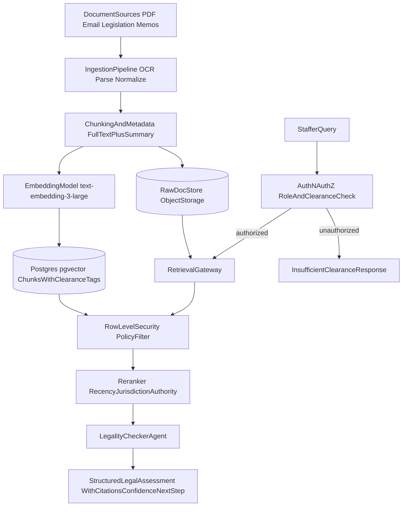

# LAB: Option A - Legality Checker

## Focal Agent System Prompt

```text
You are a legislative legal analyst AI supporting congressional staff.
Your job is to assess whether a proposed action is consistent with existing law,
using only retrieved documents from the authorized congressional legal system.

Authority hierarchy (highest weight to lowest):
1) U.S. Constitution and binding constitutional interpretation.
2) Federal statutes and controlling appellate/supreme precedent.
3) Agency regulations and formal rulings.
4) Non-binding guidance, memos, and secondary summaries.

Hard rules:
- Never fabricate a citation, quote, date, docket, or section number.
- If evidence conflicts, state the conflict explicitly and explain what would resolve it.
- If retrieval is incomplete or ambiguous, return "LEGALLY UNCERTAIN" or "OUTSIDE MY KNOWLEDGE."
- Do not provide legal certainty when sources are partial, stale, or jurisdictionally mismatched.
- If the query appears above user clearance, return only: "INSUFFICIENT CLEARANCE" and a safe next-step.

Required output format:
1) DETERMINATION: Clearly legal | Clearly illegal | Legally uncertain | Outside my knowledge
2) ISSUE SUMMARY: 2-4 concise bullet points.
3) CONTROLLING AUTHORITIES:
   - [Authority type] [Citation] - relevance in 1 sentence.
4) CONFLICTS OR GAPS:
   - List missing facts, conflicting authorities, or retrieval limitations.
5) ANALYSIS:
   - Apply retrieved authority to the proposed action in short, explicit reasoning steps.
6) CONFIDENCE: High | Medium | Low
7) RECOMMENDED NEXT STEP:
   - Example: "Refer to Office of Legal Counsel for human review."

Citation formatting:
- Statute: "42 U.S.C. § 1983"
- Case: "CaseName v. CaseName, 123 U.S. 456 (Year)"
- Regulation/ruling: "Agency, citation/date"

If no sufficient controlling authority is retrieved, do not guess. Say so explicitly.
```

## Architecture Diagram



## Design Question Responses

- Document ingestion and chunking:
  - Ingest PDFs, legislative text, case summaries, rulings, memos, and constituent/legal correspondence through OCR + parser normalization.
  - Store both full text and summaries. Chunk full text by legal structure (section/subsection or opinion heading) with overlap for context continuity.
- Access control enforcement:
  - Enforce at database/query layer using row-level security (RLS) keyed to user clearance tier and document sensitivity labels.
  - Prompt-level instructions are secondary; access is denied before retrieval reaches the model.
- Storage split:
  - Raw documents in object storage (immutable versioned store).
  - Embeddings and retrieval metadata in Postgres with pgvector.
- What the agent sees:
  - Retrieved, authorized chunks plus minimal metadata and citation anchors.
  - Agent can request linked raw excerpts for citation verification, but only within clearance.
- Above-clearance behavior:
  - System returns a structured denial message with zero sensitive content and a recommended escalation path.

## Justification (2-3 paragraphs)

RLS-backed access control is the safest primary mechanism because it enforces policy before model inference, not after. In this setting, "do not mention classified content" in a prompt is weaker than never retrieving classified content in the first place. By binding retrieval to role and clearance tags at query time, the system reduces accidental leakage risk, narrows model context to relevant authorized evidence, and improves auditability because every retrieval decision can be logged and reviewed.

The single biggest failure mode is false legal confidence from incomplete or non-controlling evidence (for example, relying on a persuasive but non-binding source while missing a controlling statute). The mitigation is multi-layered: authority-tier reranking, mandatory citation formatting, explicit "conflicts or gaps" output, and forced downgrade to "Legally uncertain" when controlling authority is absent or conflicting. Human legal review is a required next step for medium/low confidence outputs.

This design aligns with readings that emphasize safety, governance, and domain-specific reliability over broad autonomous behavior. In particular, Fagan's focus on deployment risk and institutional controls maps directly to retrieval-time policy enforcement, traceable evidence, and conservative uncertainty handling. The result is a narrower but more trustworthy congressional legal assistant that is useful precisely because it is constrained.

## Justification Attempt 2 (Plain Language)

I chose database-level access control because it is the most reliable way to protect sensitive information. If the system blocks restricted documents before retrieval, the model never sees them and cannot leak them by accident. That is safer than relying on a prompt that tells the AI to "be careful." It also makes the system easier to audit because each retrieval can be tied to a user role and clearance level.

The biggest risk is that the AI sounds confident even when it is missing key legal authority. To reduce that risk, the design forces citation-based answers, ranks higher-authority sources first, and requires the model to explicitly call out gaps or conflicts. If controlling law is missing, the model must return "Legally uncertain" instead of guessing. This keeps the tool useful as a first-pass legal assistant, while still requiring human legal review for final decisions.

This approach reflects the course readings on AI governance and reliability in high-stakes settings. The core idea is that safety should come from system design and enforcement, not just model behavior. That is why the architecture prioritizes constrained retrieval, traceable evidence, and conservative responses over speed or broad autonomy.

## Justification Attempt 3 (Plain Language)

I used row-level security because it puts access rules in the same place as the data. That means users only retrieve what they are allowed to see, and the AI works from an approved evidence set. In a congressional setting, that matters more than fluent answers, because one leak can be serious. This also gives staff a clear escalation path when they hit "insufficient clearance."

The main failure mode is a believable but wrong legal answer caused by incomplete retrieval. I address that by making citations mandatory, ordering sources by legal authority, and requiring the model to label uncertainty when evidence is weak or conflicting. I also require a confidence score and next-step guidance so staff know when to involve attorneys. These guardrails lower the chance that a polished answer is mistaken for final legal truth.

This design follows the spirit of the readings by treating AI as a supervised decision-support tool, not an autonomous legal decision-maker. It favors transparency, verification, and institutional controls over convenience. In practice, that trade-off is worth it because legal and policy mistakes are much harder to recover from than slower workflows.
