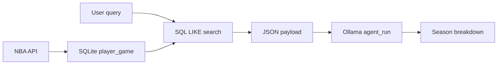

# Spurs season RAG

`spurs_season_rag.py` implements the **Create Your Own RAG AI Query** lab using a **SQLite** store of **San Antonio Spurs** per-game player lines, plus **Ollama** ([`functions.py`](functions.py) → `agent_run`). All canonical code for this lab lives in **`13_end2/spurs_reporter/`** (not under `07_rag/`). This is separate from **`06_agents`** (v1 single-game reporter).

---

## Overview

- **`spurs_season_store.py`** — Creates `data/spurs_season.db`, tables `player_game` and `game_line_score` (quarter team scoring), loads Spurs games for a single season via **nba_api** (LeagueGameFinder + BoxScoreTraditionalV3 + BoxScoreSummary for quarters). **`--refresh`** inserts **Spurs and opponent** player lines per game (opponent `wl` is inverted from the Spurs result). **Search** uses SQL `LIKE`.
- **`spurs_season_rag.py`** — CLI: `--refresh` to load data; positional **query** retrieves rows, passes **JSON + allowed names** to the LLM for a **season-style breakdown**.

---

## Prerequisites

- **Python 3** — install packages from **`../requirements.txt`** (see **`README_spurs_dependencies.md`**).
- **Ollama** running locally, model available (e.g. `llama3.2` for tool-capable flows).

Run all commands from **`13_end2/spurs_reporter`** (repo-root relative):

```bash
cd 13_end2/spurs_reporter
pip install -r ../requirements.txt

# One-time or periodic: fill DB for one season (network; hits NBA stats API)
python spurs_season_rag.py --refresh

# Query
python spurs_season_rag.py "Wembanyama points and rebounds"
python spurs_season_rag.py "Fox" --search-limit 60 --model llama3
```

| Flag | Description |
|------|-------------|
| `--refresh` | Rebuild `player_game` from one NBA season |
| `--season` | NBA season to fetch (default: **current** season from the calendar) |
| `--season-type` | Season type filter (default `Regular Season`) |
| `--search-limit` | Max SQL rows sent to the model (default 40) |
| `--db` | SQLite path (default `data/spurs_season.db`) |
| `--model` | Ollama model (default `llama3.2` in `functions.py`; older docs may say `llama3`) |

---

## Data structure

| Column | Description |
|--------|-------------|
| `game_id` | NBA game ID |
| `game_date` | Date |
| `matchup` | e.g. `SAS @ CHA` |
| `wl` | For `team=SAS`, Spurs W/L; for opponent rows, that team's outcome (inverted from Spurs in the same game). |
| `team` | `SAS` or opponent tricode (e.g. `DEN`). |
| `player_name` | e.g. `V. Wembanyama` (from API `nameI`) |
| `min`, `pts`, `reb`, `ast`, `stl`, `blk`, `turnovers`, `plus_minus` | Box line |

| `game_line_score` | One row per `game_id`: regulation quarters, `spurs_final` / `opp_final` (API final scores, includes OT). Re-run `--refresh` to backfill after upgrades (including opponent `player_game` rows). |

---

## Flow



---

## Lab submission mapping

| Task | This project |
|------|----------------|
| Data source | SQLite `data/spurs_season.db`, table `player_game` |
| Search | `search_player_games()` in `spurs_season_store.py` — splits the query into tokens and matches **any** token with `LIKE` (so e.g. `Wembanyama scoring` finds `V. Wembanyama`; common words like *scoring* / *points* are ignored as search terms). |
| RAG | JSON from retrieved rows → `agent_run` in `spurs_season_rag.py` |

---

← [LAB: Create Your Own RAG AI Query](../07_rag/LAB_custom_rag_query.md)
