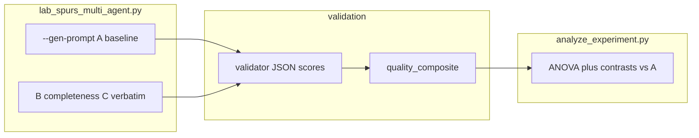

# AI Report Validation (`13_end2/validation`)

`validation` implements the **Homework 3** custom validator: four **1–5 Likert** dimensions plus two optional **booleans**, distinct from the Module 9 LAB rubric (`accuracy`, `formality`, `faithfulness`, etc.). Reports are scored by an LLM using anchored criteria in [`rubric.py`](rubric.py). **`spurs_bias`** is coded so **5 = strongest Spurs/homer tone** and **1 = most neutral**.

---

## Overview

**Outputs**: JSON-style scores per report (`factual_accuracy`, `completeness`, `structure`, `spurs_bias`), **`quality_composite`** (higher is better: inverts `spurs_bias` via \((6 - \texttt{spurs\_bias})\)), optional booleans, and scripts for **batch scoring**, **pilot variance checks**, and **one-way ANOVA / contrasts vs Prompt A**.

- **Rubric**: [`rubric.py`](rubric.py) — full anchors embedded in the validator prompt.
- **Single report**: [`single_validate.py`](single_validate.py) — stdin or `--file`.
- **Batch CSV**: [`batch_validate.py`](batch_validate.py) — many rows → scores CSV.
- **Inference**: [`analyze_experiment.py`](analyze_experiment.py) — ANOVA on `--primary` (default `quality_composite`), ANOVA on `spurs_bias`, Welch **t-tests vs baseline** with Bonferroni; optional **`--contrast B C`** planned pairwise on the same primary outcome.
- **Pilot**: [`pilot_check.py`](pilot_check.py) — warns if between-prompt mean range is narrow.
- **Batch generation**: [`run_generation_batch.py`](run_generation_batch.py) — calls the Spurs lab for each prompt × replicate and builds `reports_batch.csv`; optional `--validate` / `--analyze`.

Generation presets (**A** = baseline, **B** and **C** = full standalone system prompts) live in [`../spurs_reporter/lab_spurs_multi_agent.py`](../spurs_reporter/lab_spurs_multi_agent.py) (`--gen-prompt A|B|C`).

---

## Generate reports automatically

[`run_generation_batch.py`](run_generation_batch.py) runs [`../spurs_reporter/lab_spurs_multi_agent.py`](../spurs_reporter/lab_spurs_multi_agent.py) as a subprocess (**cwd** = `spurs_reporter`), parses stdout using the markers `--- Agent 1 (retrieval via tool) ---` and `--- Agent 2 (report, no tools) ---`, and writes **`prompt_id`**, **`report_id`**, **`report_text`**, **`source_context`** (retrieval block), plus **`replicate`**.

**Loop counts**

| Step | Count |
|------|--------|
| Lab subprocesses | `number_of_prompts × replicates` (default prompts `A,B,C` and `-n 5` → **15** runs) |
| Validator calls if `--validate` | **same as rows in the reports CSV** (one per successful lab run) |

**Examples** (from `13_end2`; **Ollama** must be running):

```bash
# Plan only
python validation/run_generation_batch.py --dry-run -n 10

# Generate CSV only (default out: validation/data/reports_batch.csv)
python validation/run_generation_batch.py -n 10

# Full pipeline: generate → batch_validate → analyze_experiment
python validation/run_generation_batch.py -n 10 --validate --analyze

# Save raw stdout per run for debugging
python validation/run_generation_batch.py -n 3 --raw-dir validation/data/raw_runs
```

Forward **`--model`**, **`--db`**, **`--season`**, **`--limit`** to the lab. Use **`--scores-out`** to set the scores CSV path when chaining (**`--validate`** / **`--analyze`**). **`--validation-provider`** is passed to **`batch_validate`**.

**Hold game constant across runs:** **`--recap-game-date YYYY-MM-DD`** replaces **`--query`** with a fixed-date recap request so every replicate pulls the same contest (less retrieval variance than “latest game”).

From the **repo root** (`sandbox/`):

```bash
python3 validation/run_generation_batch.py -n 5 --dry-run
```

---

## Validation criteria table

| Dimension | Scale | Benchmark / direction |
|-----------|-------|----------------------|
| `factual_accuracy` | 1–5 | 5 — claims match facts and optional source block. |
| `completeness` | 1–5 | 5 — answers implied checklist / brief. |
| `structure` | 1–5 | 5 — clear organization and flow. |
| `spurs_bias` | 1–5 | **5 — maximum pro-Spurs / homer tone**; **1 — neutral national-sports tone.** |
| `uses_we_our_for_spurs` | bool | true — inappropriate fan “we/our” for Spurs. |
| `opponent_named_fairly` | bool | true — fair opponent framing when relevant. |
| `quality_composite` | derived | Mean of `factual_accuracy`, `completeness`, `structure`, and \((6 - \texttt{spurs\_bias})\); **higher is better.** |

Validator JSON: Likert fields outside 1–5 are **clamped** to the nearest valid integer so batch rows are not dropped.

---

## Flow



---

## Usage

**Prerequisites**: Python 3.10+, dependencies from [`../requirements.txt`](../requirements.txt), **Ollama** running locally *or* **`OPENAI_API_KEY`** for OpenAI. Copy [`validation/.env.example`](.env.example) to `13_end2/.env` and adjust.

**Environment**

| Variable | Description |
|----------|-------------|
| `VALIDATION_AI_PROVIDER` | `ollama` (default) or `openai`. |
| `OLLAMA_HOST` | Default `http://localhost:11434`. |
| `OLLAMA_MODEL` | Default `llama3.2:latest`. |
| `OPENAI_API_KEY` | Required if provider is `openai`. |
| `OPENAI_MODEL` | Default `gpt-4o-mini`. |

**Commands** (run from `13_end2`):

```bash
# One report
python validation/single_validate.py --file path/to/report.txt --source path/to/retrieval.txt

# Batch (CSV columns: prompt_id, report_id, report_text; optional source_context)
python validation/batch_validate.py -i validation/data/reports_batch.csv -o validation/data/scores.csv

# Pilot spread check
python validation/pilot_check.py --scores validation/data/scores.csv

# Statistical analysis (default primary: quality_composite)
python validation/analyze_experiment.py --scores validation/data/scores.csv

# Same scores: emphasize completeness or bias (B vs C hypotheses)
python validation/analyze_experiment.py --scores validation/data/scores.csv --primary completeness
python validation/analyze_experiment.py --scores validation/data/scores.csv --primary spurs_bias

# Planned B vs C contrast on primary outcome (Bonferroni pools with baseline contrasts)
python validation/analyze_experiment.py --scores validation/data/scores.csv --primary completeness --contrast B C

# Descriptive / effect-size block + mean(SD) for every Likert (good for write-ups)
python validation/analyze_experiment.py --scores validation/data/scores.csv --all-likerts

# Box plot of quality_composite (or --column) by prompt_id → PNG
python validation/plot_scores_boxplot.py --scores validation/data/scores.csv -o validation/data/quality_composite_boxplot.png

# Dry run (no LLM): bundled synthetic scores for pipeline check
python validation/analyze_experiment.py --scores validation/data/scores_example.csv
```

**From the repo root** (`sandbox/`), the same scripts are wrapped so paths stay relative to `13_end2`:

```bash
cd /path/to/sandbox
python3 validation/analyze_experiment.py --scores validation/data/scores.csv
python3 validation/analyze_experiment.py --scores validation/data/scores_example.csv
python3 validation/batch_validate.py -i validation/data/reports_batch.csv -o validation/data/scores.csv
```

**Arguments**: [`batch_validate.py`](batch_validate.py) supports `--text-col`, `--source-col`, `--provider`, `--sleep`, `--keep-raw`. [`analyze_experiment.py`](analyze_experiment.py) supports `--primary` (default `quality_composite`) and `--baseline` (default `A`).

---

## Technical details

- **Packages**: `pandas`, `requests`, `python-dotenv`, `scipy` (for ANOVA / t-tests).
- **Layout**: `13_end2/validation/` — package modules and CLI scripts; generation remains under `13_end2/spurs_reporter/`.

---

## Generation presets (experimental design)

Same **output shape** as **A** for each retrieval mode (one recap paragraph, two sentences for head-to-head, etc.). **B** and **C** are **full standalone** system prompts, not short addendums.

| Preset | Role |
|--------|------|
| **A** | Baseline — [`ROLE_AGENT_REPORT_RECAP`](../spurs_reporter/lab_spurs_multi_agent.py) / fact / head-to-head roles unchanged. |
| **B** | **Completeness** — standalone prompt stresses outcome, flow, and standouts (recap) or full answer / explicit PPG list (other modes) within the same format as **A**. |
| **C** | **Verbatim grounding** — standalone prompt stresses neutral recap + exact figures from the block (recap) or strict match to tables / Trusted line (other modes). |

Use the same **model**, **DB**, and **user query** across presets; only `--gen-prompt` changes.
